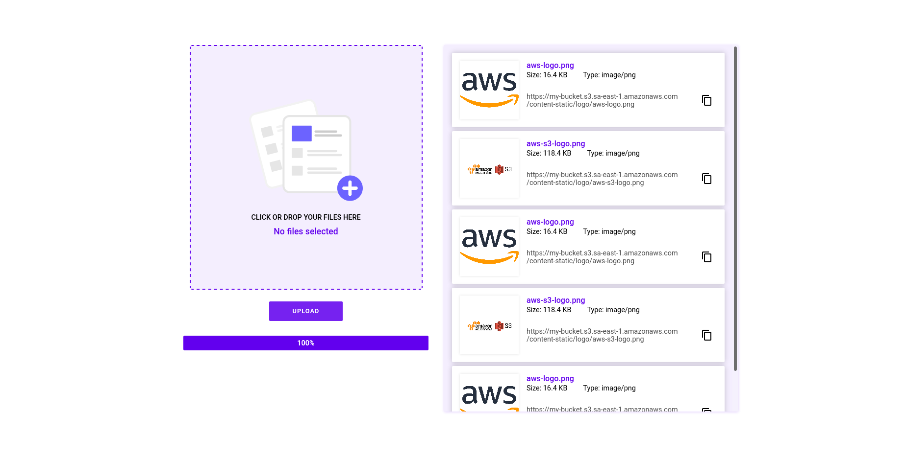

<h1 align="center">S3 Image Upload</h1>

This project was bootstrapped with [Create React App](https://github.com/facebook/create-react-app).

## Project preview

    

## Requirements

Create a `.env` file from the `.env.default` file at the root of the project and populate the new file with your AWS S3 access information.

## Available Scripts

In the project directory, you can run:

### `npm start`

Runs the app in the development mode.\
Open [http://localhost:3000](http://localhost:3000) to view it in the browser.

The page will reload if you make edits.\
You will also see any lint errors in the console.

### `npm run build`

Builds the app for production to the `build` folder.\
It correctly bundles React in production mode and optimizes the build for the best performance.

The build is minified and the filenames include the hashes.\
Your app is ready to be deployed!

See the section about [deployment](https://facebook.github.io/create-react-app/docs/deployment) for more information.

## Author

<h2>José Monte</h2>

Development with :heart:

    
    <space></space>
    
    <space></space>
    

